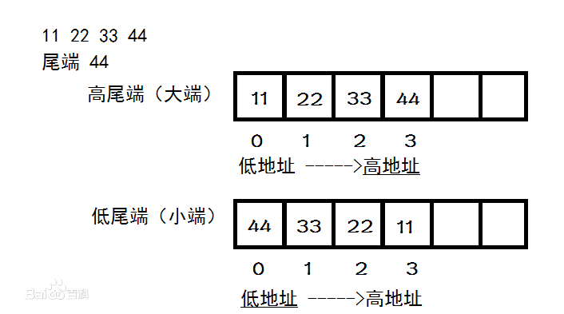

# 位/字节/字

## 位

英文名字叫（bit），是计算机中最基本的单位。

## 字节

字节Byte代表系统能够处理的最小单位，不一定是8比特。只是现代计算机的事实标准就是用8比特来代表一个字节，最小寻址单元，具有地址。

## 字

字节以上，便是[字](https://baike.baidu.com/item/字/12027948)：16个位为一个字，它代表计算机处理指令（一次可处理的二进制数字的数目）或数据的二进制数位数，是计算机进行数据存储和数据处理的运算的单位。通常称16位是一个字，而32位呢，则是一个双字，64位是两个双字。

## 转换

1B(Byte)=8bit(bit)

1KB( Kilobyte，千字节)=1024B

1MB( Megabyte，兆字节)=1024KB

1GB( Gigabyte，吉字节，千兆)=1024MB

1TB( Trillionbyte，万亿字节，太字节)=1024GB

1PB( Petabyte，千万亿字节，拍字节)=1024TB

1EB( Exabyte，百亿亿字节，艾字节)=1024PB

1 ZB(Zettabyte，十万亿亿字节，泽字节)=1024EB

1YB( Yottabyte，一亿亿亿字节，尧字节)=1024ZB

BB( Brontobyte，千亿亿亿字节)=1024YB

# 大小端

的说法源自《格列佛游记》。我们知道，鸡蛋通常一端大一端小，小人国的人们对于剥蛋壳时应从哪一端开始剥起有着不一样的看法。同样，计算机界对于传输多字节字（由多个字节来共同表示一个数据类型）时，是先传高位字节（大端）还是先传低位字节（小端）也有着不一样的看法，这就是计算机里头大小端模式的由来了。无论是写文件还是网络传输，实际上都是往流设备进行写操作的过程，而且这个写操作是从流的低地址向高地址开始写（这很符合人的习惯），对于多字节字来说，如果先写入高位字节，则称作大端模式。反之则称作小端模式。也就是说，大端模式下，字节序和流设备的地址顺序是相反的，而小端模式则是相同的。一般网络协议都采用大端模式进行传输。

