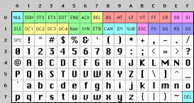
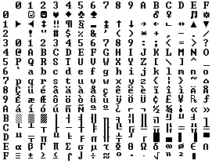
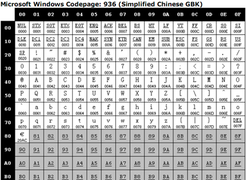
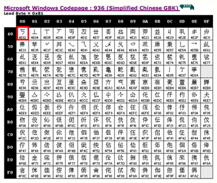
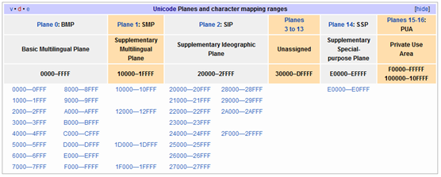
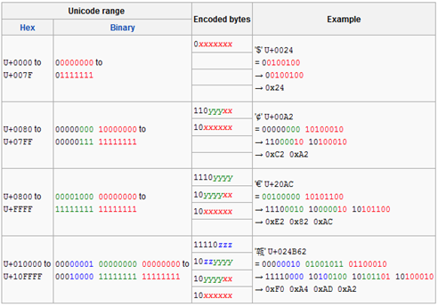

 

# 单字节编码

字符集都是基于单字节编码，也就是说，一个字节翻译成一个字符，共256字符。

## ASCII字符集，也称ASCII码。

使用7个比特位存储和处理ASCII码，最高位1比特被用作一些通讯系统的奇偶校验。

ASCII字符集由95个可打印字符（0x20-0x7E）和33个控制字符（0x00-0x19，0x7F）共128（0~127）个字符组成。

## OEM字符集

前128（0x00~0x7F）个保持与ASCII字符相同，后面128（0x80-0xFF）个数字编码方案各OEM字符集不统一。

# 双字节编码

双字节字符集编码（Double Byte Character Set）使用1-2个字节

中文字符集GB2312，涵盖了所有简体字符以及一部分其他字符；

GBK（K代表扩展的意思）则在GB2312的基础上加入了对繁体字符等其他非简体字符。

Windows系统采用936代码页来实现对GBK字符集的编解码。

解码：根据第一个字节来选择不同的码表进行解析。

字节的最高位是0的话（0x00-0x7F），那么就使用936代码页中的第1张码表进行解码，保持与单字节字符集的编解码方式一致。

当字节的高位是1的时候，当第一个字节位于0x81–0xFE之间时，根据第一个字节不同找到代码页中的相应的码表。0x8140如图所示。

# Unicode字符集

为了解决在一份文档中无法显示所有字符这个问题，Unicode字符集涵盖了目前人类使用的所有字符，并为每个字符进行统一编号，分配唯一的字符码（Code Point）。

Unicode字符集将所有字符按照使用上的频繁度划分为17个层面（Plane），每个层面上有65536个字符码空间。

所有的字符集都是和具体编码方案绑定在一起的，

例如ASCII编码系统规定使用7比特来编码ASCII字符集；

GB2312以及GBK字符集，限定了使用最多2个字节来编码所有字符，并且规定了字节序。

这种方式的缺点在于，字符和字节流之间耦合得太紧密了，从而限定了字符集的扩展能力。

因此Unicode在设计上考虑到了这一点，将字符集（字符-字符码）和字符编码（字符码-二进制）分离开。

## 带签名的UTF-8指的是什么意思？

带签名指的是字节流以BOM标记开始。很多软件会“智能”的探测当前字节流使用的字符编码，这种探测过程出于效率考虑，通常会提取字节流前面若干个字节，看看是否符合某些常见字符编码的编码规则。由于UTF-8和ASCII编码对于纯英文的编码是一样的，无法区分开来，因此通过在字节流最前面添加BOM标记可以告诉软件，当前使用的是Unicode编码，判别成功率就十分准确了。但是需要注意，不是所有软件或者程序都能正确处理BOM标记，例如PHP就不会检测BOM标记，直接把它当普通字节流解析了。因此如果你的PHP文件是采用带BOM标记的UTF-8进行编码的，那么有可能会出现问题。

## Unicode编码和以前的字符集编码有什么区别？

早期字符编码、字符集和代码页等概念都是表达同一个意思。例如GB2312字符集、GB2312编码，936代码页，实际上说的是同个东西。但是对于Unicode则不同，Unicode字符集只是定义了字符的集合和唯一编号，Unicode编码，则是对UTF-8、UCS-2/UTF-16等具体编码方案的统称而已，并不是具体的编码方案。所以当需要用到字符编码的时候，你可以写gb2312，codepage936，utf-8，utf-16，但请不要写unicode。

## 乱码问题

关于乱码中出现?或者�，这里需要额外提一下，当程序使用特定字符编码解析字节流的时候，一旦遇到无法解析的字节流时，就会用?或者�来替代。因此，一旦你最终解析得到的文本包含这样的字符，而你又无法得到原始字节流的时候，说明正确的信息已经彻底丢失了，尝试任何字符编码都无法从这样的字符文本中还原出正确的信息来。

# UTF字符编码

Unicode转换格式（Unicode Transformation Format）

## UCS-2/UTF-16

UCS-2和UTF-16对于BMP层面的字符均是使用2个字节来表示，并且编码得到的结果完全一致。不同之处在于，UCS-2最初设计的时候只考虑到BMP字符，因此使用固定2个字节长度，也就是说，他无法表示Unicode其他层面上的字符，而UTF-16为了解除这个限制，支持Unicode全字符集的编解码，采用了变长编码，最少使用2个字节，如果要编码BMP以外的字符，则需要4个字节。

## UTF-8

UTF-8应该是目前应用最广泛的一种Unicode编码方案。由于UCS-2/UTF-16对于ASCII字符使用两个字节进行编码，存储和处理效率相对低下，并且由于ASCII字符经过UTF-16编码后得到的两个字节，高字节始终是0x00，很多C语言的函数都将此字节视为字符串末尾从而导致无法正确解析文本，后来聪明的人们发明了UTF-8编码，解决了这个问题。

UTF-8编码方案采用1-4个字节来编码字符。

对于ASCII字符的编码使用单字节，和ASCII编码一摸一样。

对于其他字符，则使用2-4个字节来表示，其中，首字节前置1的数目代表正确解析所需要的字节数，剩余字节的高2位始终是10。

下图中的x代表Unicode码的低8位，y代表高8位

## GB18030

中国的GB18030编码，覆盖了Unicode所有的字符，因此也是一种Unicode编码。只不过他的编码方式并不像UTF-8或者UTF-16一样，将Unicode字符的编号通过一定的规则进行转换，而只能通过查表的手段进行编码。

# 必要的术语解释

## 字符集（Character Set）

字面上的理解就是字符的集合，例如ASCII字符集，定义了128个字符；GB2312定义了7445个字符。而计算机系统中提到的字符集准确来说，指的是已编号的字符的有序集合（不一定是连续）。

## 字符码（Code Point）

指的就是字符集中每个字符的数字编号。例如ASCII字符集用0-127这连续的128个数字分别表示128个字符；GBK字符集使用区位码的方式为每个字符编号，首先定义一个94X94的矩阵，行称为“区”，列称为“位”，然后将所有国标汉字放入矩阵当中，这样每个汉字就可以用唯一的“区位”码来标识了。例如“中”字被放到54区第48位，因此字符码就是5448。而Unicode中将字符集按照一定的类别划分到0~16这17个层面（Planes）中，每个层面中拥有216=65536个字符码，因此Unicode总共拥有的字符码，也即是Unicode的字符空间总共有17*65536=1114112。

## 编解码

编码的过程是将字符转换成字节流。

解码的过程是将字节流解析为字符。

## 字符编码（Character Encoding）

是将字符集中的字符码映射为字节流的一种具体实现方案。例如ASCII字符编码规定使用单字节中低位的7个比特去编码所有的字符。例如‘A’的编号是65，用单字节表示就是0x41，因此写入存储设备的时候就是b’01000001’。GBK编码则是将区位码（GBK的字符码）中的区码和位码的分别加上0xA0（160）的偏移（之所以要加上这样的偏移，主要是为了和ASCII码兼容），例如刚刚提到的“中”字，区位码是5448，十六进制是0x3630，区码和位码分别加上0xA0的偏移之后就得到0xD6D0，这就是“中”字的GBK编码结果。

## 代码页（Code Page）

一种字符编码具体形式。早期字符相对少，因此通常会使用类似表格的形式将字符直接映射为字节流，然后通过查表的方式来实现字符的编解码。现代操作系统沿用了这种方式。例如Windows使用936代码页、Mac系统使用EUC-CN代码页实现GBK字符集的编码，名字虽然不一样，但对于同一汉字的编码肯定是一样的。

