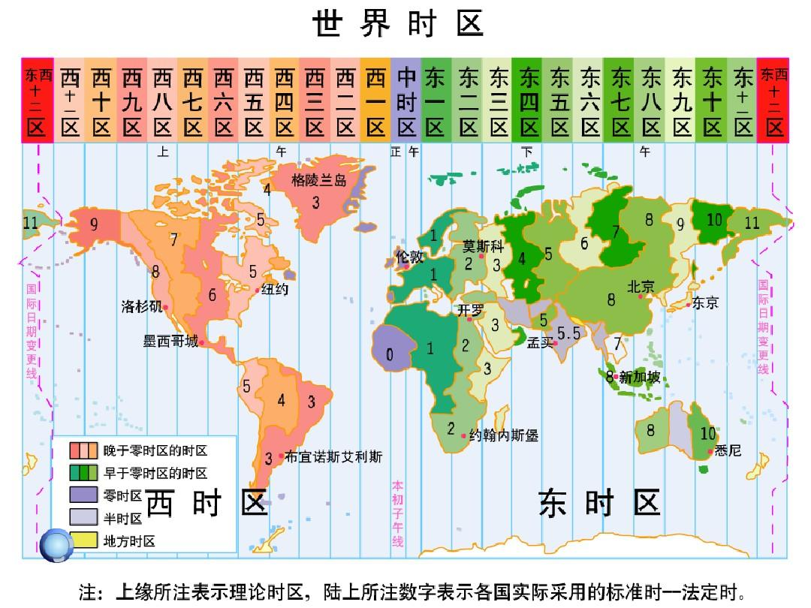
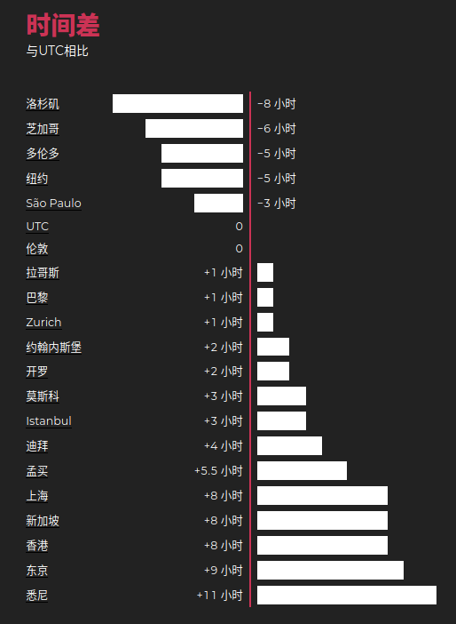

时区(Time Zone)

地球是自西向东自转，东边比西边先看到太阳，东边的时间也比西边的早。

为了克服时间上的混乱，1884年在华盛顿召开的一次国际经度会议(又称国际子午线会议[1] )上，规定将全球划分为24个时区(东、西各12个时区)。规定英国(格林尼治天文台旧址)为中时区(零时区)、东1-12区，西1-12区。每个时区横跨经度15度，相邻两个时区的时间相差1小时。例如，中国东8区的时间总比泰国东7区的时间早1小时，而比日本东9区的时间晚1小时。

# 如何计算区时

计算的区时=已知区时-(已知区时的时区-要计算区时的时区)，(注:东时区为正，西时区为负)。

# 举例说明:

例1:已知东京(东九区)时间为5月1日12:00，求北京(东八区)的区时?

北京时间=12:00-(9-8)=11:00(即北京时间为5月1日11:00)。

例2:已知北京时间为5月1日12:00，求伦敦(中时区)的区时?

伦敦时间=12:00-(8-0)=4:00(即伦敦时间为5月1日4:00)。

例3:已知北京时间为5月1日12:00，求纽约(西五区)的区时。

纽约时间=12:00-[8-(-5)]=-1:00+24:00-1天=23:00(即纽约时间为4月30日的23:00)。(注:当算出的区时为负数时，应加上24:00，日期减一天，即从5月1日变为4月30日)。

例4:已知纽约时间为5月1日12:00，求东京的区时?

东京时间=12:00-[(-5)-9]=26:00-24:00+1天=2:00)即东京时间为5月2日2:00)。(注:当算出的区时大于或等于24:00时，应减去24:00，日期加一天，即从5月1日变为5月2日)。

# 常用时区

UTC:协调世界时，又称世界统一时间、世界标准时间、国际协调时间。由于英文（CUT）和法文（TUC）的缩写不同，作为妥协，简称UTC。

| GMT  | 格林尼治标准时间 | 周四 07:14 | UTC+0 | GMT+0 |
| ---- | ---------------- | ---------- | ----- | ----- |
| CST  | 中国标准时间     | 周四 15:14 | UTC+8 | GMT+8 |
| THA  | 泰国时间         | 周四 14:14 | UTC+7 | GMT+7 |
| JST  | 日本标准时间     | 周四 16:14 | UTC+9 | GMT+9 |

